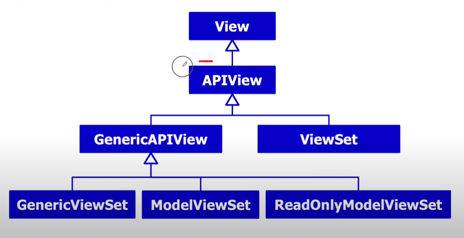
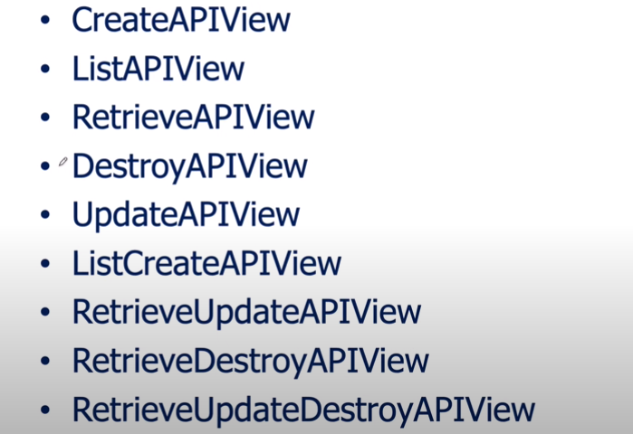
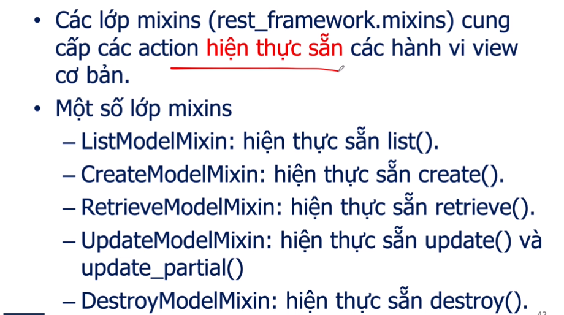
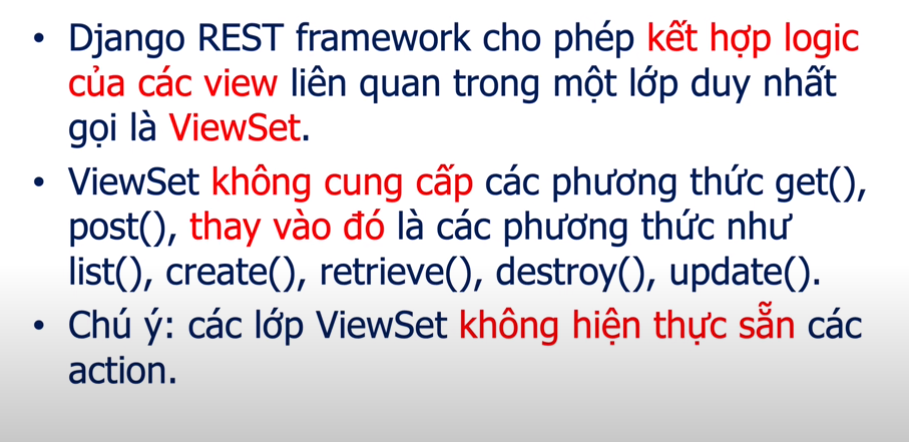

### DJANGO REST FRAMEWORK

#### Một số nội dung quan trọng trong DRF

##### Các thuộc tính của Request.

- request.data : dữ liệu của request body (Trong postman).
- request.query_params: các tham số truyền từ request get
- request.method: trả về phương thức (chữ in hoa) thực hiện request (GET, POST, PUT, DELETE, PATCH).
- request.content_type: trả về chuôĩ đại diện cho media type cửa request body.
- request.user : các user đã chứng thực thì nó trả về thể hiện của `django.contrib.auth.models.User`. Ngược lại, nó là thể hiện của `django.contrib.auth.models.AnonymousUser`
- request.auth : chứa thông tin bổ sung chức thực, nó phụ thuojc cách chứng thực, nhưng nó thường chứa thông tin token cửa request.
- request.authenticators: các chính sác chứng thực, trong các lớp APIVIew hoặc @api_view thuộc tính được thiết lập thông qua thuộc tính authentication_classes hoặc giá trị thuộc tính cấu hình DEFAULT_AUTHENTICATORS

##### Các thụôc tính Response

- REST Framework cung cấp lớp Response trả về nội dung với nhiều dạng `media type` phụ thuộc vào client request. Lớp Response là lớp con cửa Django SimpleTemplateResponse.
- Cú pháp tạo response:

```python

Response(data, status=None, template_name = None, headers=None, content_type=None)
```

+ data : dữ liệu đã được serialize.
+ status : status code cho response, mặc định là 200
+ headers : từ điển HTTP cho reponse.
+ content_type : content type cho response.
+ template_name: tên template sử dụng nếu HTMLRenderer được chọn.

##### Các thuộc tính Serializer

- Serializer cho phép chuyển các dữ liệu phức tạp như `querysets` hoặc thể hiện của model thành các kiểu dữ liệu JSON, XML hay một content type nào khác.
- Nó cũng cung cấp khẳ năng deserializer để chuyển dữ liệu đã được chuyển về kiểu dữ liêu phức tạp ban đầu sau khi đã kiêm tra (validate).
- Phương thức validate() dùng để kiểm tra chung cho nhiêu nhieuefturonwgf tỏng serializer, phương thức có một đối số duy nhất là từ điển chức giá trị các trường.
- Phương thức validate_<field_name> sẽ trả về gía trị kiểm tra cửa trường tương ứng hoặc ném ngoại lệ serializers.ValidationError.
- Chú ý : Nếu <field_name> được khai báo required là false thì validate không được thực hiện.
- Lớp serializer cung cấp các phương thức chung để xử lí output cho response.
- Lớp ModelSerializer giúp nhanh chóng tọ lớp Serializer với các trường tương ứng với các trường của Model. Khi đó :
  - tự tạo các filed giống model.
  - Tự tạo validator cho serializer.
  - Bao gồm các phương thức mặc định như save, update, create

##### Các thuộc tính trong Meta Class:

- model : lớp model liên kết cho serializer.
- fileds : chỉ định các fields sẽ được serialize, thiết lập là `__all__`  để serialize tất cả các field.
- read_only_fields: chỉ định các field chỉ đọc.
- exclude : chỉ định các field khoog serialize.
- extra_kwargs: bổ sung mộ số thông tin ràng buộc trên fileds.
- deep:

##### View trong django




###### GeneticView 

- GeneticView giúp phát triển nhanh APIView
- GeneticAPIView kế thừa APIView, bổ sung thêm một số hành vi chuẩn như list, detail
- queryset: trẳ về các đối tượng từ view, Queryset sẽ được thực thi một lần khi nó được sử dụng (evaluated) và nó sẽ được lưu đêm (cached) cho các lần truy vấn sau. Nếu có ghi đề phương thức get_query_set() thì kết quả sẽ ưu tiên cao hơn.
- serializer_class: lớp serializer được sử dụng để validate, deserialize input và serialize output. Ta có thể ghi đề phương thức get_serializer_class() thay thế
- lookup_field: các trường





###### Các lớp Mixins




###### ViewSet


