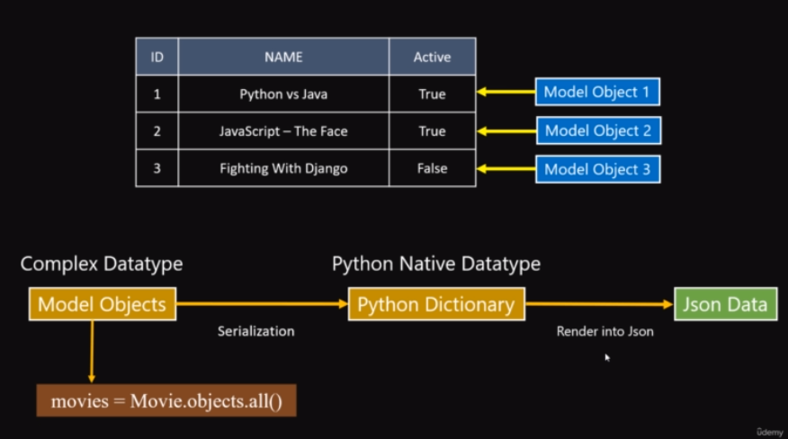
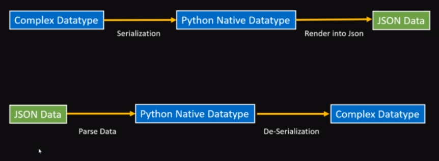

### SERIALIZERS TRONG DJANGO DRF





Trong Django Rest Framework (DRF), serializer là một thành phần quan trọng giúp chuyển đổi dữ liệu từ và đến các định dạng khác nhau, như JSON. Serializer giúp kiểm tra và xác thực dữ liệu đầu vào, cũng như chuyển đổi đối tượng Python thành dữ liệu có thể được truyền đi hoặc lưu trữ.

Dưới đây là một ví dụ cơ bản về cách sử dụng serializer trong Django Rest Framework:

1. **Tạo một model:**

```python
# models.py
from django.db import models

class Book(models.Model):
    title = models.CharField(max_length=100)
    author = models.CharField(max_length=50)
    publication_date = models.DateField()
```

2. **Tạo một serializer cho model trên:**

```python
# serializers.py
from rest_framework import serializers
from .models import Book

class BookSerializer(serializers.ModelSerializer):
    class Meta:
        model = Book
        fields = ['id', 'title', 'author', 'publication_date']
```

Serializer này sử dụng `ModelSerializer` từ DRF để tự động sinh ra các trường dựa trên model `Book`. Bạn có thể tùy chỉnh các trường hoặc thêm các trường mới theo nhu cầu.

3. **Sử dụng serializer trong views hoặc API views:**

```python
# views.py
from rest_framework.views import APIView
from rest_framework.response import Response
from rest_framework import status
from .models import Book
from .serializers import BookSerializer

class BookList(APIView):
    def get(self, request):
        books = Book.objects.all()
        serializer = BookSerializer(books, many=True)
        return Response(serializer.data)

    def post(self, request):
        serializer = BookSerializer(data=request.data)
        if serializer.is_valid():
            serializer.save()
            return Response(serializer.data, status=status.HTTP_201_CREATED)
        return Response(serializer.errors, status=status.HTTP_400_BAD_REQUEST)
```

Trong ví dụ trên, `BookList` là một API view sử dụng serializer để xử lý dữ liệu. Phương thức `get` sử dụng serializer để chuyển đổi danh sách sách thành dữ liệu có thể truyền đi, trong khi phương thức `post` sử dụng serializer để xác thực và lưu dữ liệu mới.

4. **Đăng ký URL cho views:**

```python
# urls.py
from django.urls import path
from .views import BookList

urlpatterns = [
    path('books/', BookList.as_view(), name='book-list'),
]
```

Trên đây là một ví dụ đơn giản về cách sử dụng serializer trong Django Rest Framework. Serializer đóng vai trò quan trọng trong việc xử lý và biến đổi dữ liệu trong ứng dụng Django của bạn.
